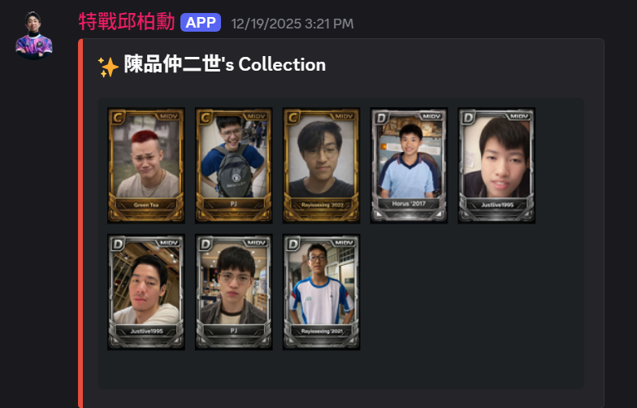
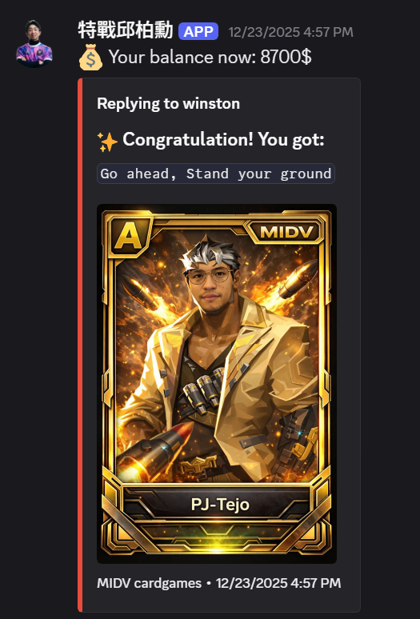

# 🎴 Discord Card Game Bot

A Discord bot that allows players to play card-based collection game directly inside a discord server.

---

## 🎮 Demo

### Gameplay Preview

---

## ✨ Features

- 🎲 Random card drawing
- 👥 Multiplayer interaction in Discord
- 🃏 Custom card decks
- ⚙️ Command-based gameplay
- 🔄 Game state management

---

## 📜 Commands

## 📜 Commands

### 🎴 Card / Gacha

| Command | Description |
|--------|------------|
| `!daily` | Claim daily free pull |
| `!drop <package>` | Open a card pack (`basic`, `exclusive`, `premium`) |
| `!shop` | View available card packages |
| `!sell <card_id> <amount>` | Sell cards for money |

---

### 🎒 Inventory

| Command | Description |
|--------|------------|
| `!collection` | Show your card collection (image + web viewer) |
| `!list` | List all your cards, balance, and remaining pulls |

---

### 💰 Economy

| Command | Description |
|--------|------------|
| `!daily` | Limited free pulls per day |
| `!drop <package>` | Spend money to open packs |

---

### 🎮 Games

| Command | Description |
|--------|------------|
| `/blackjack` | Play Blackjack |
| `/blackjack_invite` | Invite another player |

---

### 🛠 Admin

| Command | Description |
|--------|------------|
| `!add @user <amount>` | Add money to a user (Admin only) |

---

### 🧪 Misc

| Command | Description |
|--------|------------|
| `!hi` | Test command |
| `!pull` | Show basic instructions |
| `!help` | Show help menu |
---

## 🎯 Future Improvements

- Web UI interface
- More game modes
- Better card system
- Ranking system

---

## 👨‍💻 Author

Created by Yawei Hsu
